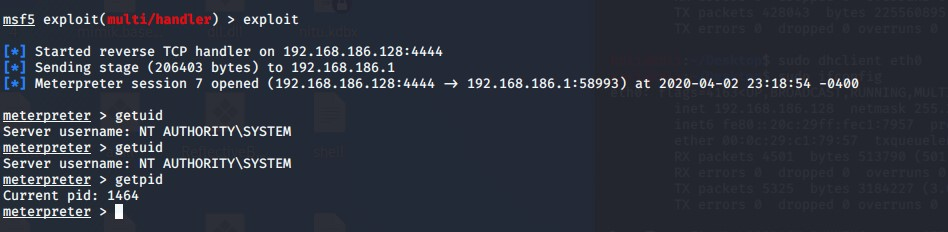

# GetSystemEarlyBird

这个版本不太已于维护，如需要二次开发建议使用 https://github.com/idiotc4t/GetSystemDumpHash.git 优化过代码结构的项目。

1.fodhelper bypassuac 后重启进程

2.添加调试权限复制winlogon进程再次重启进程

3.使用系统权限进程进程EarlyBird+fakeppid执行shellcode

4.获取系统权限shell

